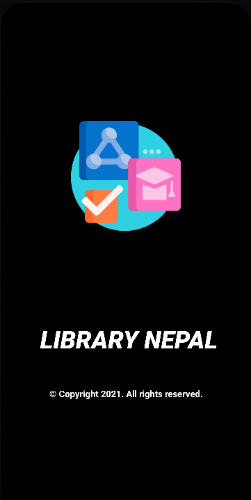
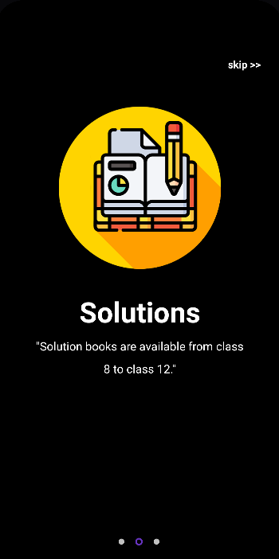
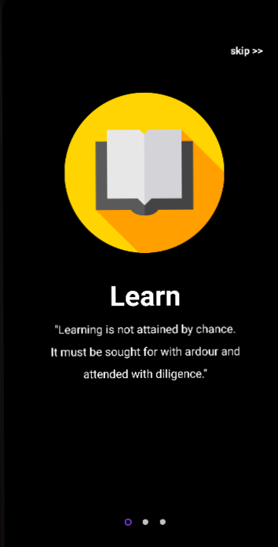
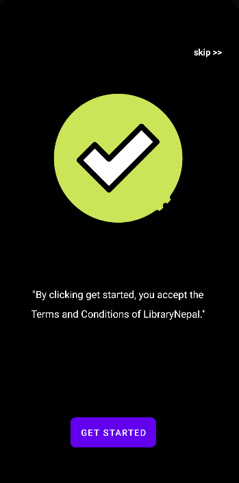
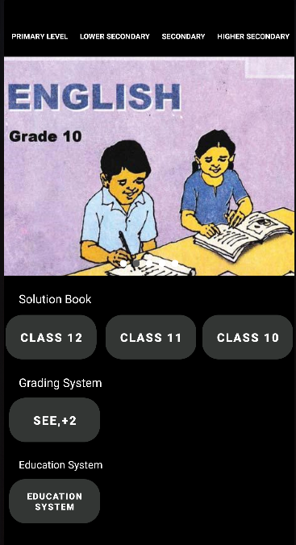
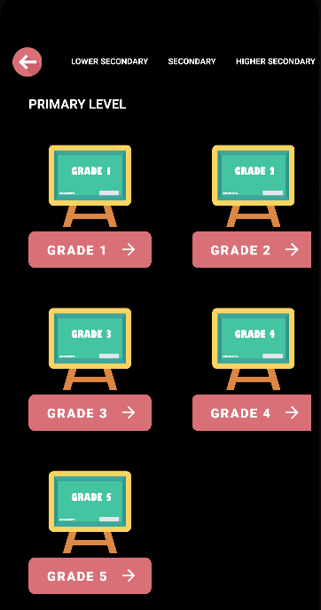
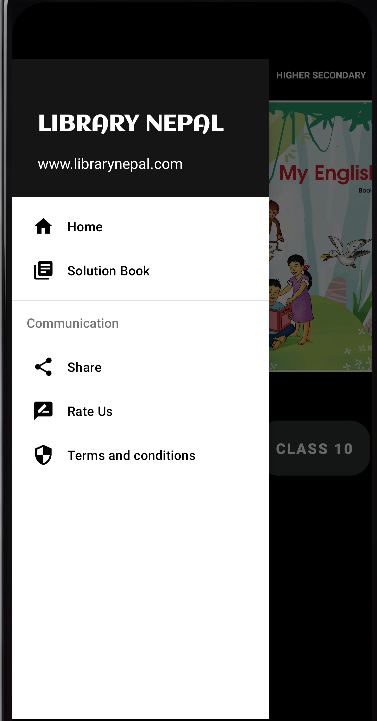
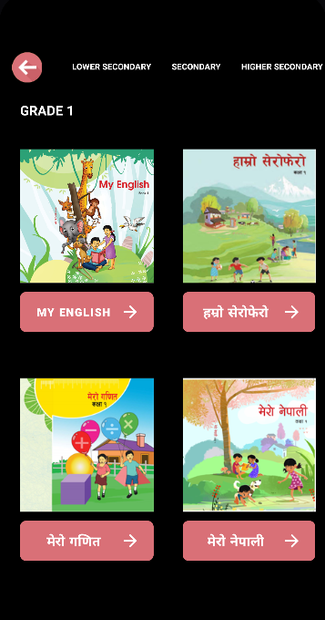

.
.
.
.
This is a test app made for school level students for notes, solutions and model questions.
.
.
.
.
This library Nepal app is here for you to finally have your books organized - in a library of books that is on your phone and therefore always with you.

Features:
- Notes
- Solutions
- Model Question

Note: With this library Nepal app, you cannot download books.

output:

       
